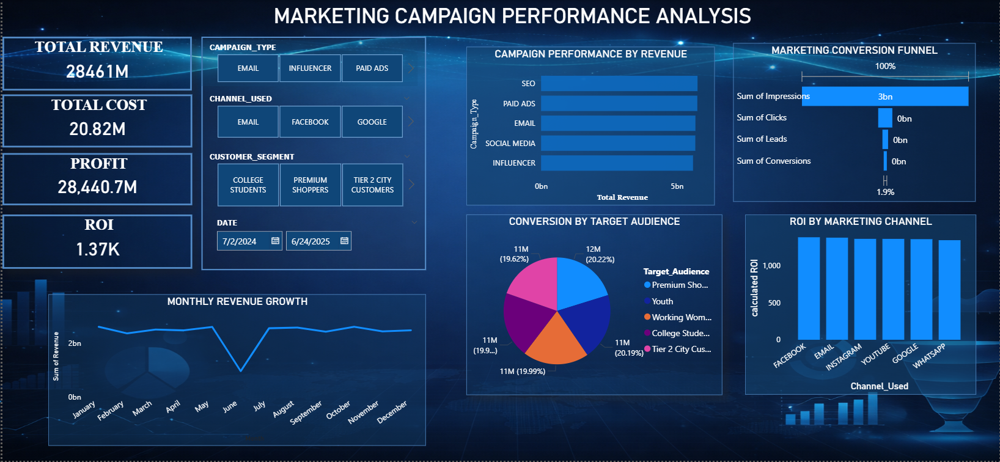

# Marketing-Campaign-Dashboard

## 📌 Project Overview
This project analyzes marketing campaign performance using Power BI.  
The dashboard provides insights into impressions, clicks, conversions, revenue, and ROI to evaluate campaign effectiveness.

## 🎯 Objectives
- Analyze campaign performance across different channels  
- Identify high-performing marketing strategies  
- Understand customer conversion behavior  
- Improve ROI through data-driven insights  

##  Tools & Technologies
- Power BI (Dashboard & Visualization)  
- SQL (Data Cleaning & Transformation)  
- Excel (Data Source)  

## 📂 Data Preparation
- Data Source: Excel file  
- Data Validation & Cleaning: Performed using Python(pandas)  
- Key Steps:
  - Checked for missing values
  - Checked for duplicate records
  - Verified and Standardized data formats  

## 📊 Key Insights
- High impressions but low conversions indicate a weak conversion funnel  
- SEO generates the highest revenue, showing strong user intent    
- Premium audience segment has better conversion rates  
- Significant drop-off observed from clicks to conversions  

## 📸 Dashboard Preview

## 📁 Files Included

- [Download Power BI Dashboard](marketing_campaign_dashboard.pbix)
- [Download Dataset](marketing_campaing_analysis.csv) 
- `mar_cam_per_analysis.png` → Dashboard preview image  

## Final Decision
The company should invest more in SEO to drive revenue growth, use Facebook for better efficiency, focus on premium shoppers, and improve conversion strategies to enhance overall performance.

## 🔗 How to Use
Download the `.pbix` file and open it in Power BI Desktop to explore the dashboard.
